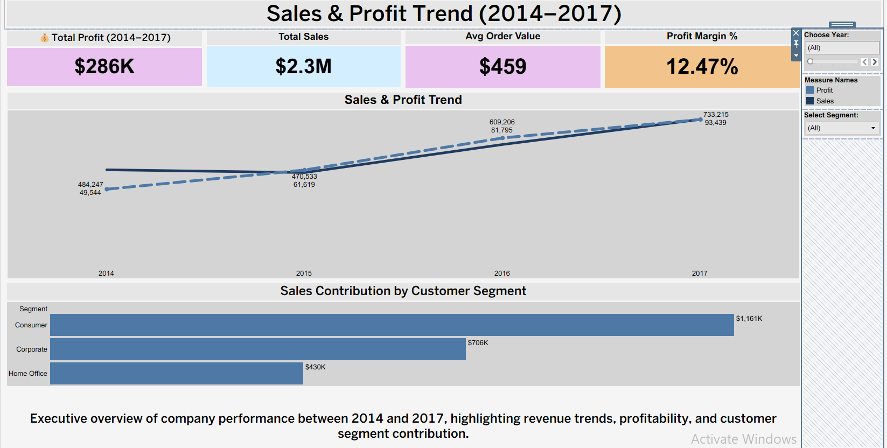
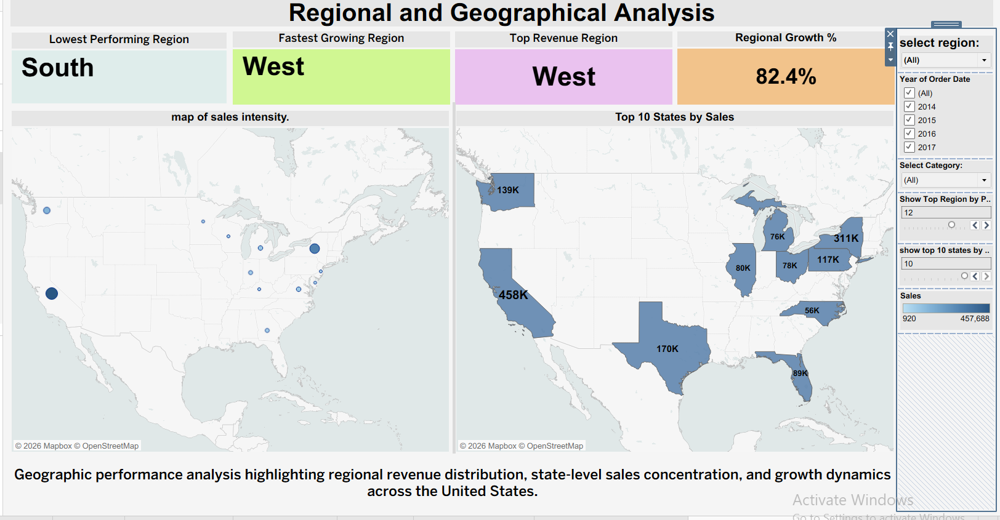
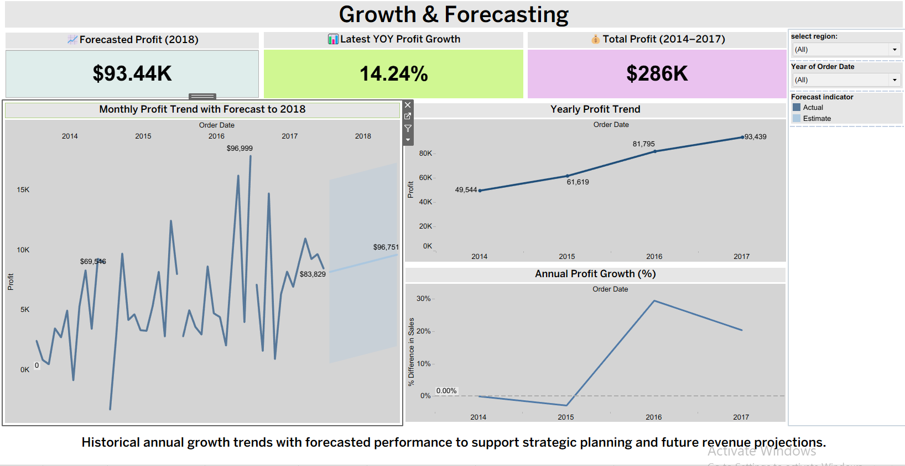

Superstore Sales Performance Dashboard using Tableau

This project presents an interactive Tableau dashboard suite analyzing sales performance, product profitability, and geographic trends using the Superstore dataset.

The dashboards provide business insights through KPI tracking, trend analysis, and regional performance evaluation.

Dashboards Included

1. Sales & Profit Trend

Analyzes revenue growth, profitability, and customer segment contributions between 2014 and 2017.

2. Product & Category Performance

Identifies top-selling products, category profitability, and revenue concentration.

3. Regional & Geographical Analysis

Visualizes sales intensity across the United States and highlights top-performing regions and states.

4. Growth & Forecasting

Evaluates historical profit growth and forecasting trends to support strategic planning.

Tools Used:

Tableau

Data Visualization

Business Intelligence

Dashboard Design

Data Analysis

Dataset

dashboard images:

## Sales & Profit Trend

## Product & Category Performance

## Regional Analysis

## Growth & Forecasting

